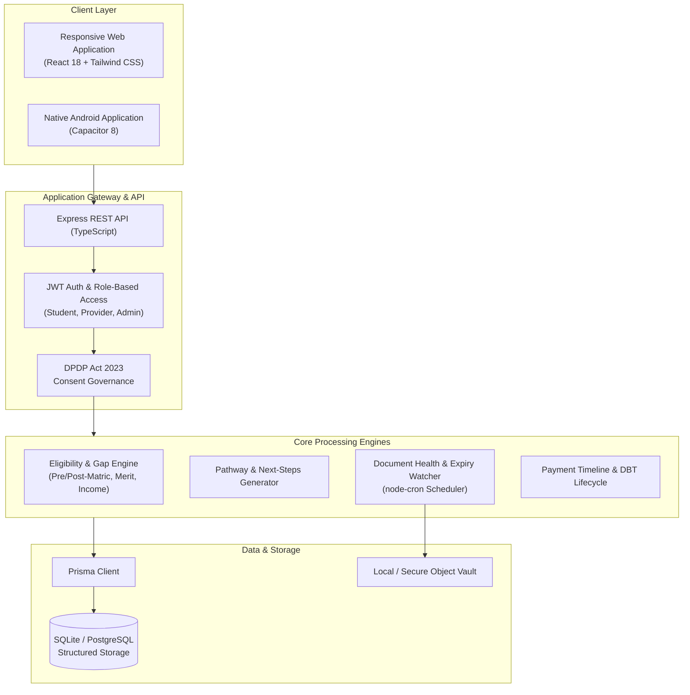

# ShikshaSaarthi (शिक्षासारथी)

> **Unified Scholarship Assistance, Automated Verification & DBT Tracking Platform**  
> Empowering students across India with transparent scholarship discovery, actionable eligibility roadmaps, sovereign document wallets, and real-time disbursement tracking.

[](https://react.dev/)
[](https://nodejs.org/)
[](https://www.prisma.io/)
[](https://tailwindcss.com/)
[-orange.svg)](https://capacitorjs.com/)
[](LICENSE)

---

## 📌 Executive Overview

**ShikshaSaarthi** is an end-to-end digital public service platform built to streamline the entire scholarship lifecycle for Indian students—with a special focus on bridging access gaps for rural, tribal, and economically disadvantaged candidates. 

By eliminating the recurring friction of manual certificate submissions, opaque rejection notices, and fragmented portals, ShikshaSaarthi provides a unified, mobile-first experience that combines:
1. **Dynamic Eligibility Engine**: Multi-parameter evaluation (State, Level, Category, Income, Merit, AISHE Institution) with clear gap identification.
2. **Actionable Eligibility Roadmap**: Chronological progression from immediate applications to high-impact future fellowships.
3. **Verifiable Scholarship Passport**: A tamper-evident, centralized student profile summarizing academic and demographic status.
4. **Sovereign Document Wallet**: Single-upload document vaulting with real-time expiry monitoring and automated health checks.
5. **JAGO Guidance Guide**: Grounded, contextual assistance helping students resolve missing requirements and application questions.
6. **Direct Benefit Transfer (DBT) Tracker**: Transparent milestone visibility from institutional verification to bank account disbursement.
7. **Vernacular & Tribal Multilingual Support**: First-class localisation in Hindi, English, Santali (Ol Chiki), Bhili, Gondi, Ho, Kurukh, Mundari, and Garo.

---

## 🏛️ System Architecture



---

## ✨ Core Features & Modules

### 1. Unified Eligibility Checker & Gap Analysis
- Evaluates student profiles against complex scholarship criteria (category, state domicile, course level, annual family income thresholds, and minimum CGPA).
- Categorizes criteria into **Passed**, **Action Required**, and **Future Progression**, giving candidates immediate clarity instead of generic rejection messages.

### 2. Eligibility Roadmap & Career Progression
- Tailors a multi-year academic pathway showing schemes students can apply for **Today**, intermediate schemes **Within Reach** with minor updates, and future opportunities (e.g., National Overseas Scholarships, Doctoral Fellowships).
- Direct "Next Steps" recommendations (e.g., renewing an income certificate, obtaining a bonafide letter).

### 3. Sovereign Document Wallet
- Centralizes mandatory documents (Caste Certificates, Income Certificates, Marksheets, Bonafide Letters).
- Automated health tracking flags certificates nearing expiry (30-day alerts) and validates format constraints before submission.

### 4. Verifiable Scholarship Passport
- Clean, print-friendly digital credential overview aggregating academic status, verified community identity, enrollment IDs, and active scholarship awards.

### 5. Multi-Dialect & Indigenous Language Support
- Built-in `i18next` localized translations supporting major tribal and regional languages:
  - English & Hindi (हिन्दी)
  - Santali (ᱥᱟᱱᱛᱟᱲᱤ — Native Ol Chiki script)
  - Bhili (भीली) & Gondi (गोंडी)
  - Ho (हो) & Mundari (मुंडारी)
  - Kurukh (कुड़ुख़) & Garo (A·chik)

### 6. DBT Payment Lifecycle Tracker
- Step-by-step transparency for scholarship funds:
  `Approved` ➔ `Sanctioned` ➔ `Payment Initiated` ➔ `Bank Validation` ➔ `DBT Processing` ➔ `Disbursed`

---

## 🛠️ Technology Stack

| Layer | Technologies |
| :--- | :--- |
| **Frontend** | React 18, TypeScript, Vite, Tailwind CSS v3, Framer Motion, Lucide Icons, i18next |
| **Mobile Runtime** | Capacitor 8 (Android SDK 34 / Java 21) |
| **Backend** | Node.js, Express, TypeScript, node-cron, Multer, Bcrypt, JsonWebToken |
| **Database & ORM**| Prisma ORM with SQLite (development/single-host) or PostgreSQL (production) |
| **Architecture** | RESTful modular micro-controllers, standard DTO patterns, middleware-enforced RBAC |
| **CI/CD** | GitHub Actions automated Android APK compiler (`.github/workflows/build-apk.yml`) |

---

## 📂 Repository Structure

```text
ShikshaSaarthi/
├── backend/                  # Express + TypeScript API Server
│   ├── prisma/
│   │   ├── schema.prisma     # Relational database schema
│   │   └── seed.ts           # Master schemes and test accounts seed
│   ├── src/
│   │   ├── modules/          # Domain services (auth, scholarships, roadmap, passport, payments)
│   │   ├── middleware/       # JWT auth, role validation, idempotency
│   │   └── server.ts         # Server bootstrap and static file handlers
│   └── tsconfig.json
│
├── frontend/                 # React 18 + Vite Web and Mobile App
│   ├── android/              # Native Android wrapper (Capacitor project)
│   ├── src/
│   │   ├── components/       # UI library (AppShell, modals, trackers, document cards)
│   │   ├── pages/            # Student, Provider, Admin, and Landing views
│   │   ├── i18n/locales/     # Comprehensive JSON translations (8+ Indian languages)
│   │   ├── context/          # Auth and profile state providers
│   │   └── api/              # Axios-based API client contracts
│   └── vite.config.ts
│
├── .github/workflows/        # Automated GitHub Actions (APK generation)
├── Dockerfile                # Multi-stage container definition
├── docker-compose.yml        # Orchestrated local/staging deployment
└── package.json              # Root workspace management
```

---

## 🚀 Quick Start Guide

### Prerequisites
- **Node.js**: v18.0.0 or higher
- **npm**: v9.0.0 or higher
- **Git**

### 1. Clone & Install Dependencies
```bash
git clone https://github.com/Tangerine24/shikshasaarthi.git
cd shikshasaarthi

# Install root, backend, and frontend dependencies
npm run install:all
```

### 2. Configure Environment Variables
Create a `.env` file in `backend/`:
```env
PORT=5000
NODE_ENV=development
JWT_SECRET=your_jwt_secret_key_here
JWT_REFRESH_SECRET=your_refresh_secret_key_here
DATABASE_URL="file:./dev.db"
CORS_ORIGIN="http://localhost:5173"
```

Create a `.env` file in `frontend/`:
```env
VITE_API_URL=http://localhost:5000/api
```

### 3. Initialize Database & Seed Master Data
```bash
cd backend
npx prisma generate
npx prisma migrate dev --name init
npm run db:seed
cd ..
```

### 4. Run Locally
**Terminal 1 (Backend API):**
```bash
cd backend
npm run dev
```

**Terminal 2 (Frontend Client):**
```bash
cd frontend
npm run dev
```

Visit `http://localhost:5173` to access the application.

---

## 📱 Mobile App (Android APK)

The frontend is fully native-ready via **Capacitor**.

### Option A: Automated Build via GitHub Actions
Every push to `main` triggers `.github/workflows/build-apk.yml`, which compiles a signed/debug APK and publishes it under GitHub repository **Actions ➔ Artifacts**.

### Option B: Local Android Build
```bash
cd frontend
npm run build
npx cap sync android
cd android
./gradlew assembleDebug
```
The output APK will be generated at:
`frontend/android/app/build/outputs/apk/debug/app-debug.apk`

---

## 🔐 Credentials for Demonstration & Testing

Pre-configured master accounts available upon running `npm run db:seed`:

| Role | Username / Email | Password |
| :--- | :--- | :--- |
| **Student** | `student@demo.shikshasaarthi.in` | `Demo@1234` |
| **Provider (Ministry / State)** | `provider@demo.shikshasaarthi.in` | `Demo@1234` |
| **Administrator** | `admin@demo.shikshasaarthi.in` | `Demo@1234` |

*(Note: For demonstration convenience, any string entered in the login form will authenticate into the student portal).*

---

## 🌐 Cloud Deployment

### 1. Render Blueprint (Recommended Single-Service)
The repository includes a ready-to-use [`render.yaml`](./render.yaml) blueprint:
1. Connect this GitHub repository in [Render Dashboard](https://dashboard.render.com).
2. Create a **New + Blueprint** and choose this repository.
3. Render automatically installs, builds both frontend and backend, and serves them under a single public URL.

### 2. Docker & Containerized Hosting
Deploy using the multi-stage [`Dockerfile`](./Dockerfile) and [`docker-compose.yml`](./docker-compose.yml):
```bash
docker-compose up --build -d
```
The application will be accessible at `http://localhost:5000`.

### 3. Decoupled Static Hosting (Vercel / Cloudflare Pages)
- **Frontend**: Deploy `frontend/` as a Vite app with root directory set to `frontend`.
- **Backend**: Deploy `backend/` on Render or Railway with `DATABASE_URL` and `JWT_SECRET`. Set `VITE_API_URL` on the frontend pointing to the deployed backend.

---

## 📄 Compliance & Data Protection

ShikshaSaarthi adheres to the **Digital Personal Data Protection (DPDP) Act, 2023**:
- Explicit, purpose-delimited consent dialogues prior to profile evaluation.
- Masked sensitive certificate identifiers on client views.
- Student sovereignty: full consent revocation and selective data-sharing controls.

---

## 🤝 Contributing & License

Contributions, bug reports, and feature proposals are welcome. Please open an issue or submit a pull request.

Distributed under the **MIT License**. See `LICENSE` for details.
